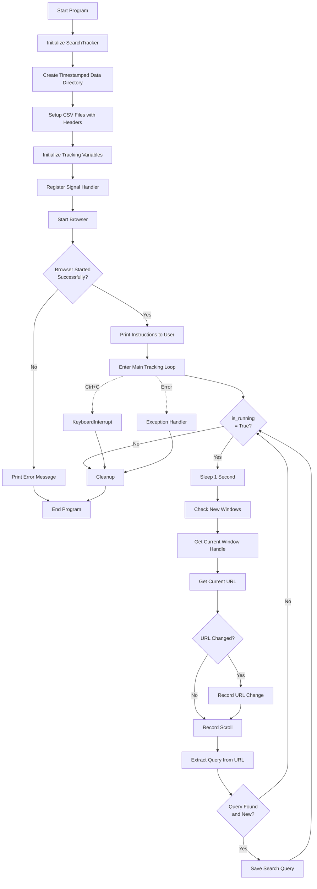
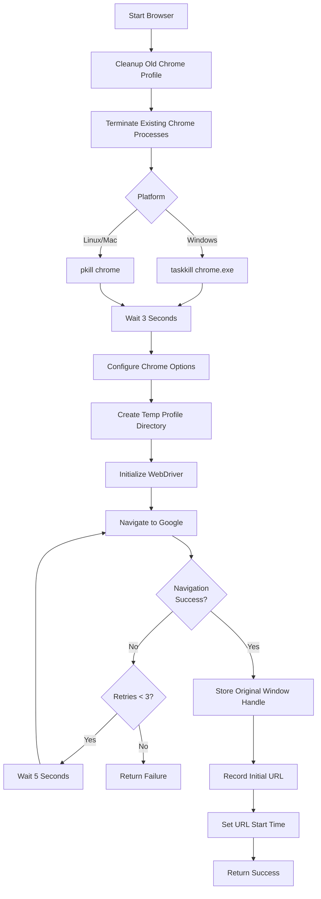
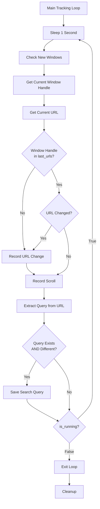
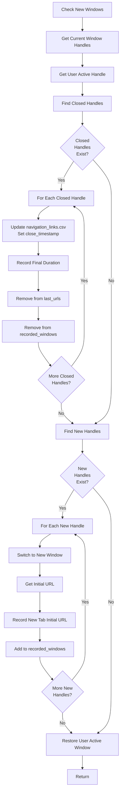
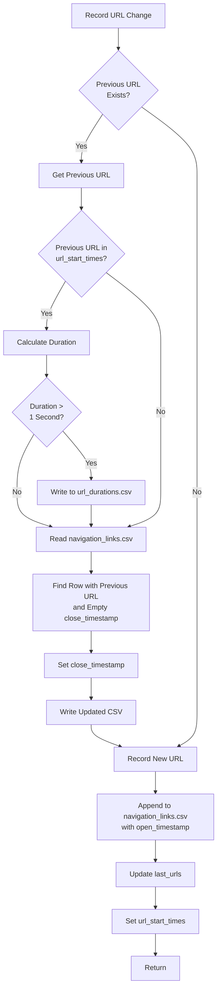
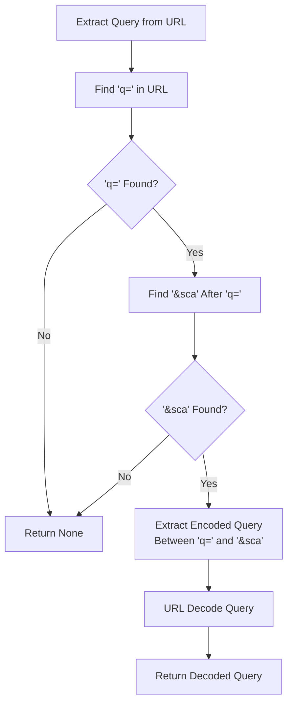
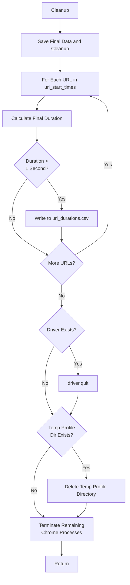

# SearchTracker Algorithm

This document describes the algorithm and workflow of the SearchTracker tool, which monitors and records web search behavior using browser automation.

## Overview

SearchTracker uses Selenium WebDriver to monitor browser activity and record:
1. Search queries extracted from Google search URLs
2. URL navigation (opening/closing pages)
3. New tab creation
4. Scroll events
5. Time spent on each URL

## Flowcharts

### Main Program Flow



### Browser Startup Flow



### Main Tracking Loop Detail



### Window Management Flow



### URL Change Tracking Flow



### Scroll Detection Flow

```mermaid
flowchart TD
    A[Record Scroll] --> B[Execute JavaScript:<br/>window.pageYOffset]
    B --> C[Get Current Position]
    C --> D{Window Handle in<br/>last_scroll_position?}
    
    D -->|Yes| E[Get Last Position]
    E --> F[Calculate Scroll Distance]
    F --> G{abs(scroll_distance)<br/>> 10 pixels?}
    
    G -->|Yes| H[Write to scrolls.csv:<br/>timestamp, distance, URL]
    G -->|No| I[Update last_scroll_position]
    H --> I
    
    D -->|No| I
    
    I --> J[Return]
```

### Query Extraction Flow



### Cleanup Flow



## Main Algorithm Flow

### 1. Initialization Phase

```
Algorithm: Initialize SearchTracker
BEGIN
    1. Create timestamped data directory
        - Format: data/YYYY-MM-DD_HH-MM-SS/
        - Store path in self.data_dir
    
    2. Initialize CSV file paths:
        - queries.csv → Search queries
        - navigation_links.csv → Page navigations
        - new_tabs.csv → New tab events
        - scrolls.csv → Scroll events
        - url_durations.csv → Time on each URL
    
    3. Setup CSV files with headers:
        - queries.csv: [Timestamp, Text]
        - navigation_links.csv: [open_timestamp, url, close_timestamp]
        - new_tabs.csv: [open_timestamp, initial_url]
        - scrolls.csv: [start_timestamp, end_timestamp, scroll_distance, url]
        - url_durations.csv: [url, start_timestamp, end_timestamp, duration_seconds]
    
    4. Initialize tracking variables:
        - is_running = True
        - recorded_windows = {}
        - window_data = {}
        - last_urls = {}
        - last_saved_query = None
        - last_scroll_position = {}
        - url_start_times = {}
    
    5. Register signal handler for graceful shutdown (Ctrl+C)
END
```

### 2. Browser Startup Phase

```
Algorithm: Start Browser
BEGIN
    1. Cleanup old Chrome profile directory if exists
    
    2. Terminate existing Chrome/ChromeDriver processes:
        - Windows: taskkill /f /im chrome.exe
        - Linux/Mac: pkill -f chrome
        - Retry up to 3 times with 1-second delays
    
    3. Wait 3 seconds for processes to fully terminate
    
    4. Configure Chrome options:
        - Start maximized
        - Disable notifications, popups, extensions
        - Set security and performance flags
        - Create temporary user data directory
    
    5. Initialize WebDriver:
        - Create ChromeDriver service
        - Set page load timeout: 30 seconds
        - Set script timeout: 60 seconds
    
    6. Navigate to Google:
        - Retry up to 3 times if navigation fails
        - Wait 5 seconds between retries
    
    7. Record initial state:
        - Store original window handle
        - Add to recorded_windows set
        - Record initial URL in navigation_links.csv
        - Set url_start_times[url] = current_time
    
    RETURN success/failure
END
```

### 3. Main Tracking Loop

```
Algorithm: Run Tracking Loop
BEGIN
    IF browser_start() FAILED THEN
        PRINT error message
        RETURN
    END IF
    
    PRINT instructions to user
    
    WHILE is_running = True DO
        SLEEP 1 second
        
        // Check for new/closed windows
        CALL check_new_windows()
        
        // Get current active window handle
        current_handle = driver.current_window_handle
        
        // Get current URL
        current_url = driver.current_url
        
        // Check for URL changes
        IF current_handle NOT IN last_urls OR 
           last_urls[current_handle] != current_url THEN
            CALL record_url_change(current_url, current_handle)
        END IF
        
        // Record scroll events
        CALL record_scroll(current_handle, current_url)
        
        // Extract and save search query if URL changed
        query = extract_search_query_from_url(current_url)
        IF query EXISTS AND query != last_saved_query THEN
            CALL save_search_query(query)
            last_saved_query = query
        END IF
        
    END WHILE
    
    EXCEPTION HANDLERS:
        - KeyboardInterrupt: Stop gracefully
        - WebDriverException: Browser connection lost
        - Other exceptions: Log error
    
    FINALLY:
        CALL cleanup()
END
```

### 4. Window Management Algorithm

```
Algorithm: Check New Windows
BEGIN
    1. Get current window handles:
        current_handles = set(driver.window_handles)
        user_active_handle = driver.current_window_handle
    
    2. Find closed windows:
        closed_handles = recorded_windows - current_handles
        FOR EACH handle IN closed_handles:
            - Update navigation_links.csv: Set close_timestamp for last URL
            - Record final duration in url_durations.csv
            - Remove handle from last_urls
            - Remove handle from recorded_windows
    
    3. Find new windows:
        new_handles = current_handles - recorded_windows
        FOR EACH handle IN new_handles:
            - Switch to new window
            - Get initial URL
            - CALL record_new_tab_initial_url(url)
            - Add handle to recorded_windows
    
    4. Restore user's active window:
        IF user_active_handle IN current_handles THEN
            driver.switch_to.window(user_active_handle)
        END IF
END
```

### 5. URL Change Tracking Algorithm

```
Algorithm: Record URL Change
BEGIN
    window_handle = input parameter
    new_url = input parameter
    
    1. IF previous URL exists for this window:
        previous_url = last_urls[window_handle]
        
        // Record duration of previous URL
        IF previous_url IN url_start_times THEN
            duration = current_time - url_start_times[previous_url]
            IF duration > 1 second THEN
                WRITE to url_durations.csv:
                    [previous_url, start_time, end_time, duration]
                DELETE url_start_times[previous_url]
            END IF
        END IF
        
        // Update close timestamp in navigation_links.csv
        READ navigation_links.csv
        FIND row WHERE url = previous_url AND close_timestamp is empty
        SET row.close_timestamp = current_time
        WRITE updated rows back to CSV
        PRINT "URL closed: previous_url"
    END IF
    
    2. Record new URL:
        APPEND to navigation_links.csv:
            [current_time, new_url, '']
        PRINT "New URL recorded: new_url"
    
    3. Update tracking variables:
        last_urls[window_handle] = new_url
        url_start_times[new_url] = current_time
END
```

### 6. Scroll Detection Algorithm

```
Algorithm: Record Scroll
BEGIN
    window_handle = input parameter
    current_url = input parameter
    
    1. Get current scroll position:
        current_position = execute_script("return window.pageYOffset;")
    
    2. IF window_handle IN last_scroll_position:
        last_position = last_scroll_position[window_handle]
        scroll_distance = current_position - last_position
        
        // Only record significant scrolls (>10 pixels)
        IF abs(scroll_distance) > 10 THEN
            WRITE to scrolls.csv:
                [current_time, current_time, scroll_distance, current_url]
        END IF
    END IF
    
    3. Update last scroll position:
        last_scroll_position[window_handle] = current_position
END
```

### 7. Query Extraction Algorithm

```
Algorithm: Extract Search Query from URL
BEGIN
    url = input parameter
    
    1. Find query parameter:
        q_index = FIND "q=" IN url
        IF q_index == -1 THEN
            RETURN None
        END IF
    
    2. Extract encoded query:
        start = q_index + 2
        sca_index = FIND "&sca" IN url STARTING FROM start
        IF sca_index == -1 THEN
            RETURN None
        END IF
        
        encoded_query = url[start:sca_index]
    
    3. Decode URL-encoded query:
        decoded_query = urllib.parse.unquote_plus(encoded_query)
    
    4. RETURN decoded_query
END
```

### 8. Cleanup Algorithm

```
Algorithm: Cleanup
BEGIN
    PRINT "Saving final data and cleaning up..."
    
    1. Record final durations:
        FOR EACH (url, start_time) IN url_start_times:
            duration = current_time - start_time
            IF duration > 1 second THEN
                WRITE to url_durations.csv:
                    [url, start_time, current_time, duration]
            END IF
    
    2. Quit browser:
        IF driver EXISTS THEN
            driver.quit()
        END IF
    
    3. Cleanup temporary files:
        IF temp_profile_dir EXISTS THEN
            DELETE temp_profile_dir
        END IF
    
    4. Final process cleanup:
        Terminate any remaining Chrome/ChromeDriver processes
END
```

## Data Structures

### Internal State Variables

- `recorded_windows`: Set of window handles being tracked
- `window_data`: Dictionary mapping window handles to window-specific data
- `last_urls`: Dictionary mapping window handles to last known URLs
- `last_saved_query`: String of the most recently saved query (for deduplication)
- `last_scroll_position`: Dictionary mapping window handles to last scroll positions
- `url_start_times`: Dictionary mapping URLs to their start timestamps

### CSV File Schemas

1. **queries.csv**
   - `Timestamp`: ISO format datetime when query was detected
   - `Text`: The search query text extracted from URL

2. **navigation_links.csv**
   - `open_timestamp`: ISO format datetime when URL was opened
   - `url`: The URL visited
   - `close_timestamp`: ISO format datetime when URL was closed (empty if still open)

3. **new_tabs.csv**
   - `open_timestamp`: ISO format datetime when tab was created
   - `initial_url`: The URL loaded when tab was first opened

4. **scrolls.csv**
   - `start_timestamp`: ISO format datetime (currently same as end_timestamp)
   - `end_timestamp`: ISO format datetime when scroll was detected
   - `scroll_distance`: Number of pixels scrolled (positive = down, negative = up)
   - `url`: URL where scroll occurred

5. **url_durations.csv**
   - `url`: The URL visited
   - `start_timestamp`: ISO format datetime when URL was first visited
   - `end_timestamp`: ISO format datetime when URL was left
   - `duration_seconds`: Time spent on URL in seconds

## Error Handling

1. **Browser Connection Loss**: Catches `WebDriverException` and attempts graceful cleanup
2. **File I/O Errors**: Wrapped in try-except blocks with error logging
3. **Signal Handling**: SIGINT (Ctrl+C) triggers graceful shutdown
4. **URL Parsing Errors**: Returns None and logs error instead of crashing
5. **Cleanup Failures**: Continues with cleanup even if some steps fail

## Performance Considerations

1. **Polling Interval**: Main loop sleeps 1 second between iterations to balance responsiveness and CPU usage
2. **Scroll Threshold**: Only records scrolls >10 pixels to reduce noise
3. **Duration Threshold**: Only records durations >1 second to filter brief navigations
4. **Deduplication**: Queries are only saved if different from last saved query

## Concurrency Notes

- The tool runs in a single-threaded loop
- Window detection is synchronous
- CSV writes are synchronous (file locking handled by OS)
- Signal handlers interrupt the main loop asynchronously

## Exit Conditions

The tracking loop exits when:
1. User presses Ctrl+C (KeyboardInterrupt)
2. Browser connection is lost (WebDriverException)
3. Unexpected error occurs (Exception)
4. Signal handler sets `is_running = False`

In all cases, the cleanup algorithm is executed to save final data and release resources.

